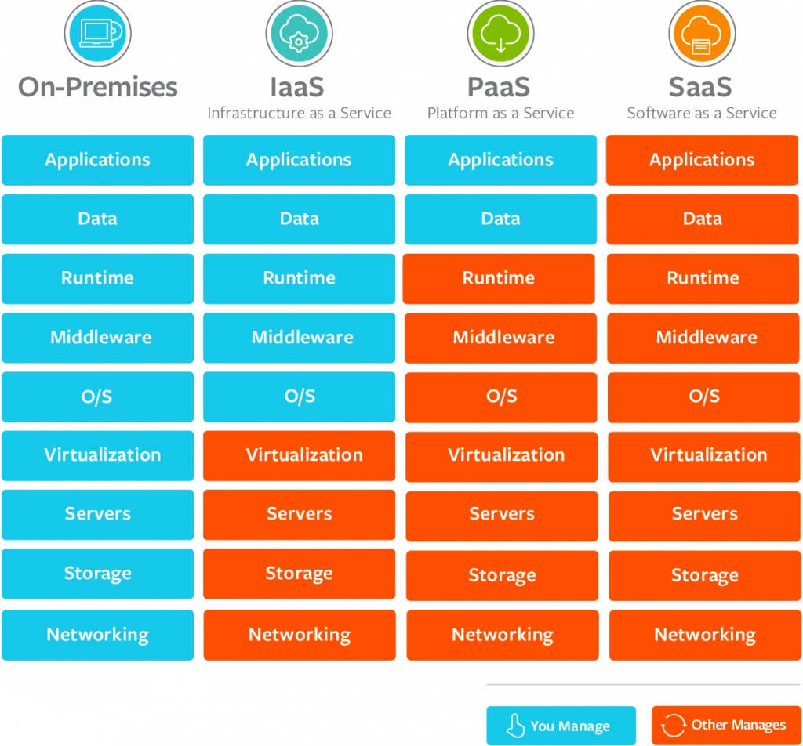
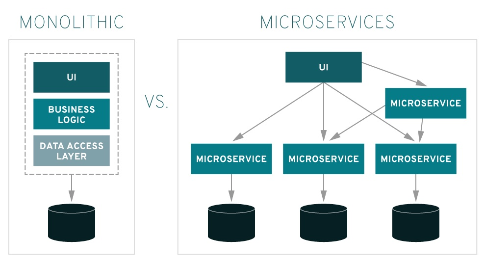
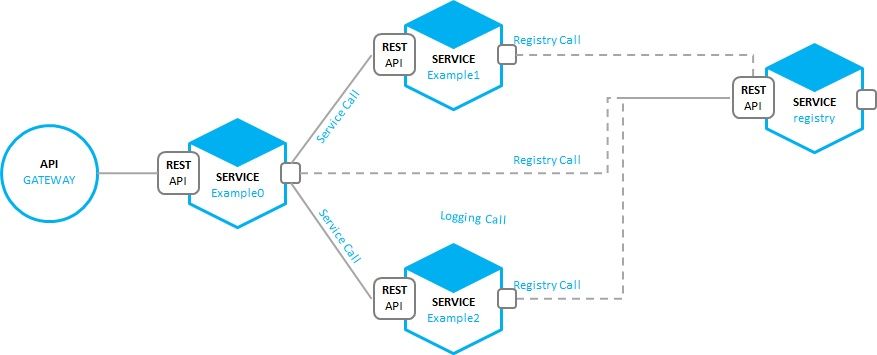
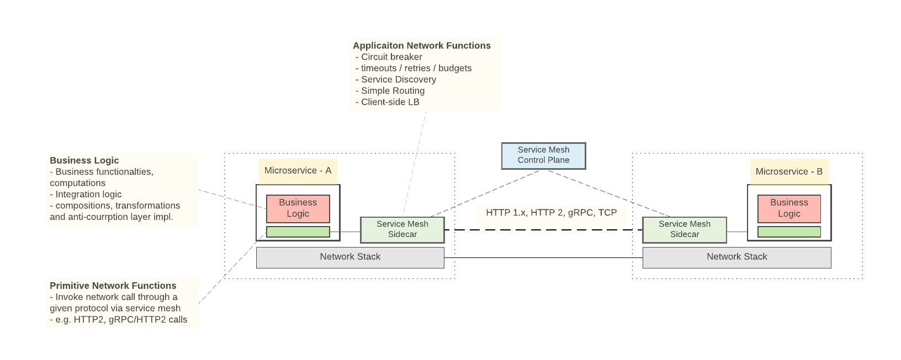
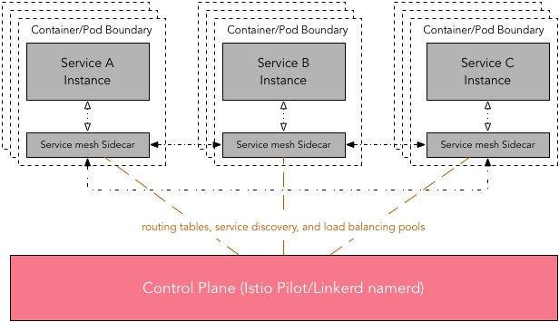
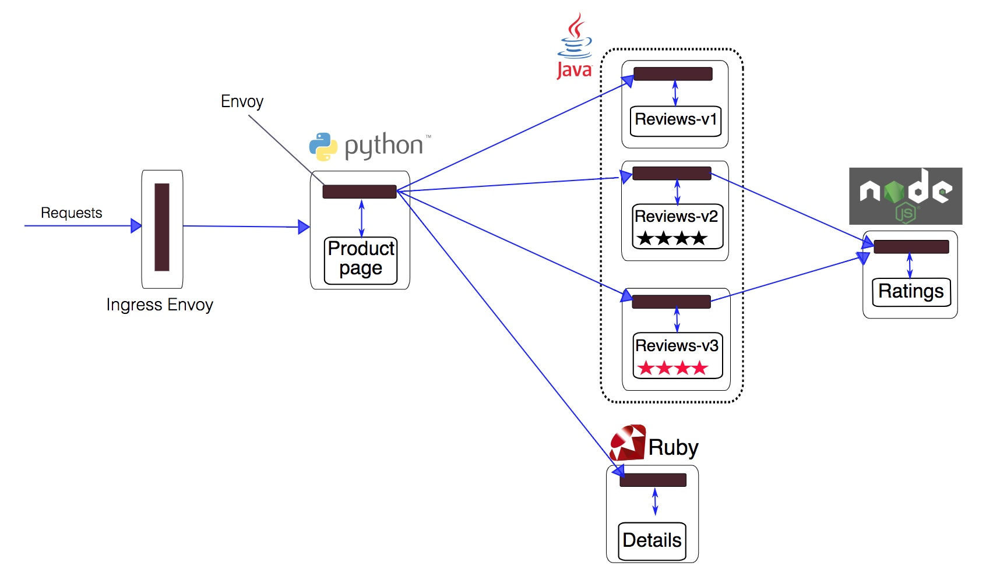
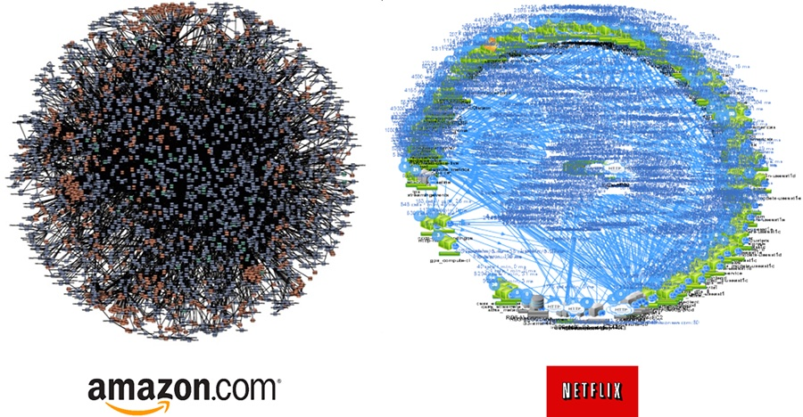
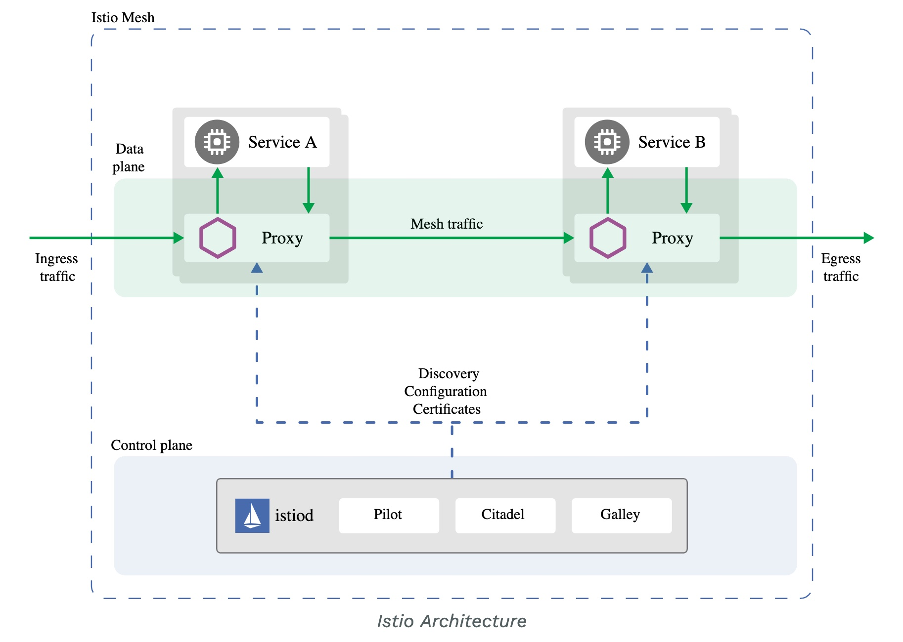

# Cloud-native applications and microservice architecture | with Istio

Cloud-native is a term used to describe container-based environments. Cloud-native technologies are used to develop applications built with services packaged in containers, deployed as microservices, and managed on elastic infrastructure through agile DevOps processes and continuous delivery workflows.

[Cloud Native Computing Foundation (CNCF)](https://www.cncf.io/), [launched](https://www.cncf.io/announcements/2015/06/21/new-cloud-native-computing-foundation-to-drive-alignment-among-container-technologies/) in 2015 by the Linux Foundation.

## Cloud definition

- remote data centers
- offers software or hardware to a business or individual
- you can access it through the Internet

## Cloud advantages

- **Flexibility and agility**   
  Cloud computing makes it easy to quickly scale up/down the capacity.
- **Security**   
  Implement effective disaster recovery solutions without large, upfront investments.
- **Automatic software and hardware updates**   
  The servers are maintained by your supplier.
- **Saves money on hardware, “pay as you go”**
- **Increased collaboration**   
  Team members can work anywhere.
- **Сompetitive advantage**   
  Small businesses have access to enterprise-class technology they couldn’t afford on their own.

[Read more](https://www.pointclick.net/moving-to-the-cloud/)

## Service model selection

- How much you can and want **to manage yourself**?
- How much you want **your service provider to manage**?

Match services yourself: DigitalOcean, Wix, Heroku, Shopify, Amazon Web Services (AWS), Salesforce, Google Cloud Platform (GCP), GitHub, Youtube, GitLab, Travis CI, IBM cloud, Trello.

[Read more](https://www.bmc.com/blogs/saas-vs-paas-vs-iaas-whats-the-difference-and-how-to-choose/_)

## Cloud-native applications

Cloud-native applications are:
- a collection of small, independent, and loosely coupled services
- providing a consistent development and automated management
- designed to run in the cloud.

**Key attributes of cloud-native:**

1. Packaged as lightweight **containers**
2. Developed with best-of-breed **languages and frameworks**
3. Designed as **loosely coupled microservices**

**Other attributes:**

4. **Centered around APIs** for interaction and collaboration
5. **Architected** with a clean separation of **stateless and stateful** services
6. **Isolated** from the server and operating system dependencies
7. **Deployed** on self-service, elastic, cloud infrastructure
8. **Managed** through agile DevOps processes   
  Each service has an independent life cycle and CI/CD.
9. **Automated** capabilities
10. Defined, policy-driven resource allocation

[Read more](https://thenewstack.io/10-key-attributes-of-cloud-native-applications/)

## Monolithic vs Microservices architecture

**Microservices** - a style that structures an application as a collection of services that are:

- highly maintainable and testable
- [loosely coupled](https://en.wikipedia.org/wiki/Loose_coupling)
- independently deployable
- organized around business capabilities
- owned by a small team
- sourced as a separate Git repo with its tests

**Monolithic** - a style where a single-tiered software application in which different components are combined into a single program from a single platform.

## Microservices are NOT

1. Your SOA (service-oriented architecture) cut into services

2. Anything involving a large framework   
  What part of "micro" are folks missing?

3. Development patterns where you deploy things into containers   
  You want containers,  do containers. Fine with me. Deployment decisions have nothing to do with microservices. If you're coupling your code to the architecture that tightly, re-read #2.
  
4. Things with some cool language   
  Once again, if you like cool languages, use them. Sounds fun. It's just has nothing to do with microservices.
  
5. Systems with thousands of little tiny pieces of code scattered all over the place making it impossible to reason about anything
  You're loving the idea to death. You've gone too far the other way. Both the "micro" and "service" part are equally important.

[Reference](https://danielbmarkham.com/honest-microservices/)

## Application centered around APIs

## Service mesh

**Service mesh** - an infrastructure layer for facilitating service-to-service communications between microservices, often using a **sidecar proxy**.

**Provides:**

  - Connection between microservices
  - Monitoring, observability into communications
  - Securing
  - Managing

### Service mesh: architecture

Platforms implementing service mesh:

  - **Istio**
  - Consul
  - Linkerd

### Service mesh: example

  
## Service mesh: real large examples

## Istio

### Istio: presentation

**Istio** - a platform that implements service mesh (provides a uniform way to secure, connect, and monitor microservices).

### Istio: usecases

Istio provides operational requirements:

- canary rollout (deployment)
- A/B testing
- rate-limiting
- access control
- end-to-end authentication

---

*The content of this document, including all text, images, and associated materials, is the exclusive property of Adaltas and is protected by applicable copyright laws. Unauthorized distribution, reproduction, or sharing of this content, in whole or in part, is strictly prohibited without the express written consent of the author(s). Any violation of this restriction may result in legal action and the imposition of penalties as prescribed by law.*
